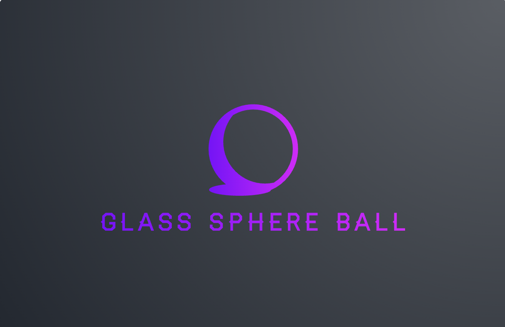

# Interactive 3D Sphere 🌐

<div align="center">
  
  
  <h3>An Immersive 3D Experience with Interactive Controls</h3>
  
  [](https://threejs.org/)
  [](https://github.com/your-repo)
</div>

## 🌍 Live Demo

[**Click here to view the live website**](https://super-frangipane-991c63.netlify.app/)

<div align="center">
  
</div>

## 🎥 Project Showcase

<div align="center">
  <table>
    <tr>
      <td align="center">Spinning Sphere</td>
      <td align="center">Interactive Controls</td>
      <td align="center">Particle Effects</td>
    </tr>
    <tr>
      <td></td>
      <td></td>
      <td></td>
    </tr>
  </table>
</div>

## ✨ Features

<table>
  <tr>
    <td width="50%">
      <h3>🔑 Interactive Controls</h3>
      <ul>
        <li>Click and drag to change sphere color</li>
        <li>Auto-rotation toggle with smooth transitions</li>
        <li>Keyboard controls for color and rotation</li>
        <li>Touch support for mobile devices</li>
      </ul>
    </td>
    <td width="50%">
      <h3>🎨 Dynamic Visuals</h3>
      <ul>
        <li>Real-time color updates with HSL controls</li>
        <li>Particle effects for added visual interest</li>
        <li>Customizable material presets (chrome, gold, glass, matte)</li>
        <li>Rim lighting for enhanced 3D effect</li>
      </ul>
    </td>
  </tr>
  <tr>
    <td width="50%">
      <h3>📱 Responsive Design</h3>
      <ul>
        <li>Optimized for desktop and mobile devices</li>
        <li>Fullscreen mode for immersive experience</li>
        <li>Adaptive UI for different screen sizes</li>
        <li>Touch-friendly controls</li>
      </ul>
    </td>
    <td width="50%">
      <h3>⚙️ Advanced Features</h3>
      <ul>
        <li>GSAP animations for smooth transitions</li>
        <li>Custom shader materials for realistic effects</li>
        <li>Environment mapping for reflections</li>
        <li>Fog effect for depth perception</li>
      </ul>
    </td>
  </tr>
</table>

## 🚀 Getting Started

### Prerequisites

- Node.js (v14.0 or later)
- npm or yarn

### Installation

1. Clone the repository
   ```bash
   git clone https://github.com/your-repo/interactive-3d-sphere.git
   ```

2. Navigate to the project directory
   ```bash
   cd interactive-3d-sphere
   ```

3. Install dependencies
   ```bash
   npm install
   # or
   yarn install
   ```

4. Start the development server
   ```bash
   npm start
   # or
   yarn start
   ```

5. Open your browser and visit
   ```
   http://localhost:3000
   ```

## 🛠️ Tech Stack

<div align="center">
  <table>
    <tr>
      <td align="center"><br/>Three.js</td>
      <td align="center"><br/>GSAP</td>
      <td align="center"><br/>Webpack</td>
    </tr>
    <tr>
      <td align="center"><br/>JavaScript</td>
      <td align="center"><br/>HTML5</td>
      <td align="center"><br/>CSS3</td>
    </tr>
  </table>
</div>

## 🌟 Key Highlights

- **Interactive 3D Sphere**: Real-time color changes and material adjustments
- **Particle Effects**: Dynamic particles for a futuristic look
- **Material Presets**: Switch between chrome, gold, glass, and matte materials
- **Responsive Design**: Works seamlessly on desktop and mobile devices
- **GSAP Animations**: Smooth transitions and animations for a polished experience

## 🎮 Future Roadmap

- [ ] Add VR support for immersive 3D experience
- [ ] Integrate AI for dynamic color suggestions
- [ ] Add more material presets (e.g., wood, marble, metal)
- [ ] Implement multiplayer mode for collaborative editing
- [ ] Add sound effects for interactive feedback

## 👥 Team

- **Project Lead**: [Your Name](https://github.com/your-profile)
- **UI/UX Designer**: [Designer Name](https://github.com/designer)
- **Frontend Developer**: [Developer Name](https://github.com/developer)
- **Backend Developer**: [Developer Name](https://github.com/developer)

## 📄 License

This project is licensed under the MIT License - see the [LICENSE](LICENSE) file for details.

## 🙏 Acknowledgements

- Three.js community for the amazing library
- GSAP for smooth animations
- Open-source contributors for inspiration and tools

---

<div align="center">
  <p>Made with ❤️ for 3D enthusiasts and developers</p>
</div>
